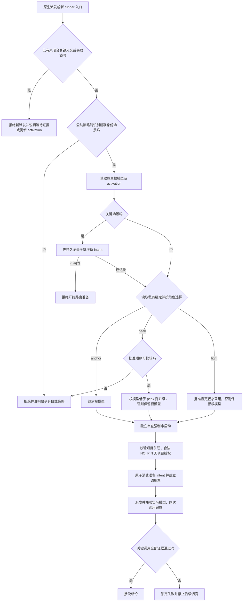

# 模型路由：问题定义、方案评估与修复验收

> 当前发布状态：DONE，提交 `0c56460` 已推送并同步本地 main，远端 CI 全绿。以下保留冻结阶段的分析与会审证据，最新状态见 [DEPLOYMENT.md](/Users/luca/Desktop/luca_gstack/framework-audit/2026-09-30-model-routing/DEPLOYMENT.md)。

状态：DONE_WITH_CONCERNS。第六轮 13 文件修复候选已获两份独立 astra 冷审 PASS 7/7，同 SHA 完整验证 PASS=107 FAIL=0 WARN=0 DELEGATED=1；私有模型关系已生效，生产 Hook 修复与授信尚未启用，等待最后真人确认。

逻辑速览见 [ROUTING-LOGIC.md](/Users/luca/Desktop/luca_gstack/framework-audit/2026-09-30-model-routing/ROUTING-LOGIC.md)。

本轮是框架维护，保持 NO_PIN。目标是让关键判断能可靠启动、保持独立、失败可见，并有实际模型与调用完成证据。范围不包含下游项目、`framework/` 模板、模型价格优化或 Git 发布。

## 1. 可核验的问题定义

| 问题 | 真实触发与根因 | 完成标准 |
|---|---|---|
| `UNKNOWN_MODEL_RELATION` | 当前根模型 `gpt-6.1-sol` 不在用户私有顺序中；关键路由不能猜它与 peak 的关系 | 用户确认关系后，原请求解析为 READY，实际专家采用 astra |
| `latest candidate boundary mismatch` | 创建判官前先解析项目关联；合法 NO_PIN 仍因旧候选事件进入原生项目边界校验 | NO_PIN 完整校验后可启动框架判官；不消费项目事件、不发项目权限；有 pin 的错误边界仍拒绝 |
| 审查带有生产历史 | 原逻辑仅在换模型时改掉 `all`，同模型或数字 fork 可继承父会话历史 | 任何 `independent_review_required` 调用都使用 `fork_turns=none` |
| 关键失败产生可信降级输出 | runner 在 invocation envelope 建立前报错，没有设置关键失败锁；workflow 将 null 转成成功 JSON 并继续调度 | 准备、运行、证据任一关键失败都锁定失败，退出非零、stdout 无可信 JSON，停止后续调度 |

第二轮补修还覆盖：同 activation 再次启动不能绕过准备失败；证据存储 I/O 出错时 Promise 必须结束并清理子进程，不能悬空。

原会话证据：根会话 `01a0ec5b-44d2-7042-a523-f634e1406260` 的原生日志出现 spawn 拒绝；兄弟会话 `01a0ebdb-a018-7093-b7fb-e803d4d07880` 原生日志第 12118 行记录 PreToolUse 的 candidate boundary mismatch。工具转发消息不能冒充原生人工项目事件，这个原则保留。

## 2. 推荐的完整逻辑

保留 common v2 的三角色机制，修复边界和执行缺口。公共策略只表达角色、场景与强制条件；私有绑定表达具体模型及用户批准的相对顺序。型号字符串不用于推断能力排名。

上述图表达逻辑职责。候选 Hook 在共同 resolver 前先记录关键 preparation intent，再验证项目关联，之后创建模型 invocation；NO_PIN 分支解除的是无关项目事件的耦合。

| 角色 | 选择规则 | 失败规则 |
|---|---|---|
| anchor | 当前原生根会话模型 | 不靠提示文本或 caller 的 `model` 改路由 |
| peak | 从批准顺序选择 peak；根模型已达到或高于 peak 时保留根模型 | 关系未知、能力未就绪或采用证据失败时，关键调用拒绝；不降级 |
| light | 只有明确获批且比根模型更轻时使用 | 不能确认更轻则保留 anchor；非关键调用保留现有 null 降级契约 |

`reasoning_effort` 是独立配置维度。路由器保留用户传入值，不以换模型暗中调节 effort。有效 effort 仍受宿主默认和自定义 agent 配置优先级影响，需要实际运行核验。

本轮用户已确认私有顺序中 `gpt-6-sol < gpt-6.1-sol < gpt-6-astra`，关键审查采用 astra。绑定文件保留原 Claude 配置与 0600 权限，未把私有型号写入公共路由规则。

在当前根模型 `gpt-6.1-sol` 下，普通执行与 explorer 继承该模型；获批机械预检选择 `gpt-6-luna`；关键 quality-gate 选择 `gpt-6-astra` 并冷启动。若根已是 astra，关键审查仍采用 astra，但冷启动要求不变。

### 当前 Codex 原生派发能力

| 原生 agent_type | 精确场景 | 路由 |
|---|---|---|
| default / worker | MR-001 | anchor |
| explorer | MR-006 | anchor |
| preflight-agent | MR-008 | light |
| quality-gate / muse-proto-judge | MR-004 | peak，独立审查 |

MR-002 规划、MR-003 红队、MR-005 不可逆前判断、MR-007 专项委托没有各自已注册的原生身份入口。不能在 prompt 中写“规划”就声称 default 采用 peak。目前关键规划或红队判断通过真实 `quality-gate` 冷启动做 MR-004 专家评估；组织输入的 default 不冒称 peak。Workflow 入口则使用公共策略中的精确 workflow/phase 表。新增原生类型属于下一项能力扩展，须注册、验证并单独评估，不能假称本轮已经实现。

### 三个必须分开的边界

1. 模型关系决定选择哪个模型；实际 adoption 决定宿主是否采用它。提问组件只能收集决定，不能自动改变当前根会话模型。
2. 独立性由冷启动决定；模型升级本身不产生独立审查。
3. 项目授权由 pin/原生事件决定；框架 NO_PIN 判官启动不应需要项目事务，成功启动也不获得任何项目读取权。

失败恢复遵循宿主 activation 生命周期：修复私有绑定不会偷偷清除已持久化的关键失败锁，正常新 activation 才恢复。快照读取不算关键准入：host 的 native 预约/建票必须在写锁内重新检查既有 critical invocation。关键预约显式绑定 route_harness，消费时与实际 route.harness 对齐。同 activation 的 compact 或根模型/generation 变化不能清除未闭合关键义务：先锁失败，再使旧票失效。关键准备开始前必须写入 intent，bindings/resolve 失败时即使失败锁无法写入，旧 intent 仍阻止下一次入口。若 evidence I/O 阻止失败锁落盘，则明确报告 `MODEL_ROUTE_CRITICAL_FAILURE_NOT_PERSISTED`，未闭合的 critical CLI ticket 同样阻止下一次 runner 和 native 入口。intent 自身不可写时，bindings/resolve 未开始，报告存储不可用，而不是伪称已经失败并落锁。任何 pending critical native/CLI invocation 都暂停新的 native/runner 入口；已绑定 agent_id 不等于完成。因此原生关键审查按顺序完成；非关键原生调用仍可并行，当前 runner 内自己新建的关键调用允许正常并行，已开始的 turn 不保证撤销。此保守规则避免把正常运行与完成证据写入失败错误地区分。匹配证据正常闭合后可继续，错误证据持久失败后只能正常新 activation 恢复。

## 3. 方案调研与取舍

| 方案 | 效果及代价 | 本轮结论 |
|---|---|---|
| A：保留 common v2，修复四个已证实缺口，明确 Claude 兼容段 | 保留用户能力顺序、证据与失败锁；改动对应已出现故障 | 推荐并提供候选补丁 |
| B：直接依赖宿主默认模型，删除共同路由门 | 配置更少，但失去私有关系判断与关键 adoption/同调用约束；不能解决可信失败传播 | 不采用 |
| C：增加动态评分、部分序关系、自动 effort/成本优化、全部场景原生注册 | 能进一步扩展，但需要新事实、新宿主能力和新的评估样本；本轮故障不要求这些复杂度 | 后续有实测需求再做 |

官方资料核对：

- [Subagents](https://developers.openai.com/codex/subagents)：未指定配置时继承父模型和 effort；显式模型与自定义 agent 文件存在配置优先级。因此框架要核验实际采用，不应只相信请求参数。
- [Hooks](https://developers.openai.com/codex/hooks)：transcript 格式不是稳定接口。现有原生日志解析只能声称在已测版本与 schema 上有效；应维护版本样本和拒绝未知格式。
- [Agents API configuration](https://developers.openai.com/api/docs/guides/agents-api/configuration)：模型与 effort 分开配置，活动 turn 不因配置变更立即切换。该 API 不能被当作 Codex Desktop 的同等能力证明。

本轮不引入价格或模型能力的客观排行榜；相对能力关系来自用户批准。

## 4. 候选补丁及行为证据

基线：`eddae51c01a07794227954b7ca87492ffe5f8c0a`。候选根：`/private/tmp/luca-model-routing-20260930-k_8tl5cj`。

冻结 13 个文件，逐文件 pre/post SHA 见 [candidate-manifest.json](/Users/luca/Desktop/luca_gstack/framework-audit/2026-09-30-model-routing/candidate-manifest.json)，可应用文本见 [reviewed-candidate.patch](/Users/luca/Desktop/luca_gstack/framework-audit/2026-09-30-model-routing/reviewed-candidate.patch)。补丁 SHA256：`9b2c53963b74f829af785b0167a0055fb35cad1fdf71668438f3bd8fdac54361`。前五轮补丁和 manifest 保留为 `round1.*` 至 `round5.*`，失败结论不被覆盖。

- `codex-child-project.mjs`：只对完整校验后的 NO_PIN 返回无 root 项目关联；保留 nested child 的后续继承逻辑。
- `model-route-hook.mjs`：独立审查统一冷启动，包括同模型和数字 fork。
- `workflow-runner.mjs`：先识别关键性，准备失败也设置失败锁；入口拒绝所有旧 pending critical invocation；阻止后续 agent/thunk/thread/turn 派发。
- `model-route-host.mjs` 与 host 回归：准备失败持久锁绑定原 activation/generation，非关键不锁，不创建缺失状态，不误伤后续 activation；证据 I/O cleanup 和旧 pending ticket 拒绝有运行时回归。
- Native admission：host 预约和建票两处在写锁内重查 pending critical ticket，封住旧快照竞态；与 CLI 已准入 runner 的内部并行分开。
- `beginCriticalPreparation`：关键模型准备先持久预约，再读绑定/resolve；调用票创建与 intent 消费在同一次原子写中完成。未闭合准备票不能被另一调用绕过。
- `updateRootAnchor`：根模型变化前保全未闭合关键义务，同 activation 不允许经压缩会话解锁。
- `.codex/hooks.json`：只刷新本仓 11 个注册命令中的 source digest，从 `cb8156bbb4dab2799bf5efa7e0b9b060427614c5083f24bdc70687a8c3dd343a` 到 `a229918d10266b91b6205ec46efb8ab65e3d612b3bd5458762caad617cecebf3`，无新增 Hook/事件/第三方条目，尚未启用或授信。
- 三个原生回归文件与 runner 回归：覆盖真实 red/green 和项目隔离负例。
- resolver mutation fixture：补齐公共绑定示例，使既有 mutation 门能真实跑完。
- 公共策略、plan-agent、orchestrator：界定 Codex common v2 与 Claude legacy，写明原生身份覆盖缺口。

| 验证 | 结果 |
|---|---|
| 旧私有绑定重放 → 已批准绑定 | `UNKNOWN_MODEL_RELATION` → READY / PEAK_SELECTED |
| NO_PIN 旧候选边界定向回归 | 修复前拒绝，修复后通过且不消费/改写项目状态，不发 receipt；伪绑定、坏 schema、未授权项目路径继续拒绝 |
| 同模型 / 数字 fork 的关键独立审查 | 修复前继承历史，修复后均为 none，用户 effort 字段保留 |
| 真实 runner 准备失败及 I/O | 三轮分别复现准备失败、I/O exit13、thunk/预约顺序漏洞；第三轮红测 PASS=68 FAIL=6，第四轮 PASS=77 FAIL=0，第五轮 native Stop 锁忙反例修复后 PASS=84 FAIL=0，FIFO 实证先预约后 bindings，失败持久化与 intent 兜底均覆盖 |
| 原生 Hook suite | PASS=108，增加真实 Hook 子进程 A 完整准入后 B 恢复旧快照的两类拒绝；增加 bound critical native 的 Stop 写锁故障、错误/正确 evidence 重试与非关键并行负例；增加 compact 根模型变化时的持续拒绝与新 activation 恢复；覆盖预约本身不可写、不读关系；预约后失败写不入仍保留 intent；后续 native/runner 拒绝；新 activation 恢复 |
| 子会话项目关联 suite | 全部通过，包括 pinned boundary mismatch 拒绝、子会话继承及原生来源负例 |
| resolver baseline + mutation | 25 个行为组通过，17/17 mutation 被杀，恢复基线通过 |
| 可信 host suite | PASS=138；27/27 host mutation 被杀并恢复基线，覆盖 pending preparation / critical native / critical CLI 跨 generation 的单调失败锁 |
| 本次新增 Hook 边界 mutation | 10/10 被杀：NO_PIN 短路/校验、冷审查、native 持久化、旧 pending workflow、预约顺序、pending preparation 入口、bound critical native 入口、native 锁内预约与建票两守卫 |
| 注册命令与已审源码执行 | 隔离 Git fixture 中真实 11 个 source digest gates 通过，安全/test 源变异拒绝后恢复；测试保护目录中的已审 native source 真正执行，bootstrap 缺失与未审 writer/adapter 修改均拒绝 |
| 事件 authority mutation / negatives | mutation 基线、三类变异拒绝、恢复通过；Claude/Codex 负例均通过 |
| 双宿主 harness 行为 | PASS=17 FAIL=0 |
| Claude Hook + Codex adapter 回归 | 全部通过；adapter PASS=24，auto-open 8/8；被隔离的 read-grant 用例明确 SKIP |
| 最终完整仓库 gate | 同 ROUND6 SHA，PASS=107 FAIL=0 WARN=0 DELEGATED=1，exit0 |
| 最终独立冷会审 | 两份 PASS 7/7；均真实 astra/high，同 turn task_complete，原判和证据独立保留 |
| 策略 SSOT / agent 合同 / runner 离线合同 | 通过 / 74/74 / PASS=19 FAIL=0 |

第四轮完整 `verify.sh --ci` 得到 PASS=105 FAIL=2 WARN=0 DELEGATED=1；两个失败同源于 orchestrator 标题丢失旧能力锚点。第五轮保留原锚点并明确仅 Claude 强制 model 传参，能力锚点门与跨宿主语义门已定向通过（31/31）；完整 `verify.sh --ci` 得到 PASS=107 FAIL=0 WARN=0 DELEGATED=1，exit0，但这不能关闭独立反证发现的并发准入缺口。第六轮完整 gate 已在同一隔离环境通过：PASS=107 FAIL=0 WARN=0 DELEGATED=1，exit0，result 中 SHA 与冻结补丁一致。第五轮 PASS 只归属于第五轮 SHA，原日志与结果保留。原先 archive/Playwright 环境准入问题已通过本地 Git clone 与离线 npm 缓存安装解决，没有联网获取依赖或执行包生命周期脚本；结果与日志见 `full-verify-result.json` / `full-verify.log`；这是隔离候选完整验证，不能据此声称生产部署完成。

生产实测：已通过原生 `quality-gate` 启动 astra 专家，实际 turn metadata 为 `gpt-6-astra`、effort 为 high；turn `01a0f068-b68b-7951-a73a-eebfc5b43612` 有同 ID 的 `task_complete`。这证明该调用采用与完成，不证明候选 Hook 已部署，也不证明内部 reroute 全部可见。

## 5. 独立会审与风险边界

初审采用 astra 的冷 `quality-gate`。初审为 FAIL 3/6：指出 legacy 文案冲突、NO_PIN 修改尚无证据、历史污染以及 mutation fixture 缺文件；本候选已逐项修复。初审不是最终通过证明。

第一轮终审分别为 FAIL 6/7 和 FAIL 5/7：准备失败只设置 runner 本地锁，同 activation 再次运行可输出可信 JSON；证据写锁占用导致 finish 提前 settled 后 Promise 悬空。已补 host 持久锁、evidence I/O cleanup/resolve 与旧 pending workflow 入口拒绝。原反例的并发派发先后关系仍 UNKNOWN，不能宣传为已证明的 race 泄漏。已启动的 turn 可以完成，保证是后续派发拒绝与可信输出抑制，不能声称撤销在途执行。

第二轮两位专家均 FAIL 6/7：其一，已锁 activation 的第二 runner 若只执行无 agent 的 thunk，仍可写 scratch marker 并输出成功 JSON；其二，关键准备失败与失败锁写入忙相遇时，磁盘没有 ticket，清锁后同 activation 又可派发。第三轮补了 runner 入口全局拒绝，以及在关键 bindings/resolve 之前持久化 preparation intent；intent 未能记录则拒绝开始准备。准备失败后即使锁写不入，intent 仍作为未闭合记录。第二轮冻结补丁同样不得启用。

第三轮冷审一位 PASS 7/7，另一位 FAIL 6/7，整体仍 FAIL。反证发现：准备失败且 latch 忙时留下的 intent，在 `SessionStart(source=compact)` 根模型变化后被失效，同 activation 又能派发。两份原判都保留。

第四轮在 `updateRootAnchor` 更新 generation 之前，把未闭合 preparation 或 critical native/CLI invocation 转为持久关键失败锁，保留首条证据，然后正常失效旧票。非关键 pending 不锁，正常新 activation 恢复。原生实际回归先红后绿，host 增加 17 项检查和 3 个 mutation。第四轮两位冷审分别 FAIL 5/7、FAIL 6/7。两者都复现已绑定 critical native 在 SubagentStop evidence 写锁忙后仍 pending、failure=false，下一原生/runner 入口放行；其中一位真实 runner 输出成功 JSON，另一位以内存源码执行独立反证。前者的 C7 为 UNKNOWN（未自行核验 adoption），原判均不修饰。

第五轮入口暂停所有未闭合关键 invocation，去掉 CLI-only 条件，覆盖已绑/未绑 native；保留非关键并行、正常 evidence 闭合后恢复，以及同 runner 内关键并行。实际红绿：native 新门先允许（错）后拒绝（对），runner 82/2 → 84/0；标题锚点也修复。第五轮会审为 PASS 7/7 与 FAIL 5/7，整体仍 FAIL。反证是 B 拿空快照后停住，A 完整准入为 critical pending，再恢复 B 仍 allow；只是读旧快照不能算已准入。专家以内存源码执行反证，主 agent 用真实 Hook 子进程交错复现了同一分支。

第六轮已将 native 预约与建票的 pending-critical 判定放入 host 既有写锁：native begin 显式携带 route_harness，native build 使用真实 route.harness；不靠 root generation 变化，因为该反例 activation/generation 均不变。保留 CLI 已准入 runner 的内部并行。主 agent 真实 Hook 进程交错从错误 allow 到正确 deny；host 同 activation/generation 三条红测变绿，27/27 mutation（含两项锁内守卫及 preparation-harness 关联）被杀。新检查不新增/消费票，不把等待证据误记为 critical failure。第六轮同 SHA 完整验证通过；两位全新冷 astra 判官分别 PASS 7/7。验收者在个人副本实跑 native108、host138、runner84、resolver25与负向mutation；反证者独立执行8组host及4组native状态机探针，并杀死两项原子守卫变异。两者亲读原生日志、注册fixture及当前全仓日志。原样 envelope、真实模型/effort及同turn完成证据见 [final-review-evidence.json](/Users/luca/Desktop/luca_gstack/framework-audit/2026-09-30-model-routing/final-review-evidence.json)。完整逻辑速览也经两位只读核对，无范围夸大。生产尚未启用。

现有 native observer 能核验最终模型和同调用完成，但对所有内部 reroute 的记录并非完整观测；不能声称穷尽检测了所有模型重试。源码 guard 也不提供对恶意同 UID 进程的 OS 隔离。本轮不扩大这些既有安全主张。

## 6. 启用边界与回退

私有模型关系已按明确答复更新。生产 Hook 源文件仍保持基线，候选代码测试不改已安装 hooks、trust 或凭据。未提交、未推送。

启用时先核验冻结 patch、基线和逐文件 preimage；应用后运行仓库 gate，再仅更新本 root 的 reviewed source manifest，保留其他 root，最后审阅并授信本仓精确 Hook 命令。不能在代码改写与 source digest 更新之间假装生产工具仍可正常运行。

必要运行入口见 [.claude/skill-os/runtime/project-session.md](/Users/luca/Desktop/luca_gstack/.claude/skill-os/runtime/project-session.md:30)：

> Updating hook code requires a new reviewed manifest and Codex hook trust for the changed command.

精确授信工具的约束见 [codex-trust-hooks.mjs](/Users/luca/Desktop/luca_gstack/scripts/codex-trust-hooks.mjs:18)：授信是“人看过这些 hook 再让它跑”，脚本不替代该判断。须完成具体补丁会审后再请求最后的启用确认。

回退采用 manifest 中逐文件 preimage及授信脚本生成的 config 备份；同样按正常 reviewed activation 更新 guard。禁止跳过 guard、整体授信第三方 Hook 或覆盖其他根。

<!-- FILE_END: model-routing/REPORT.md -->
