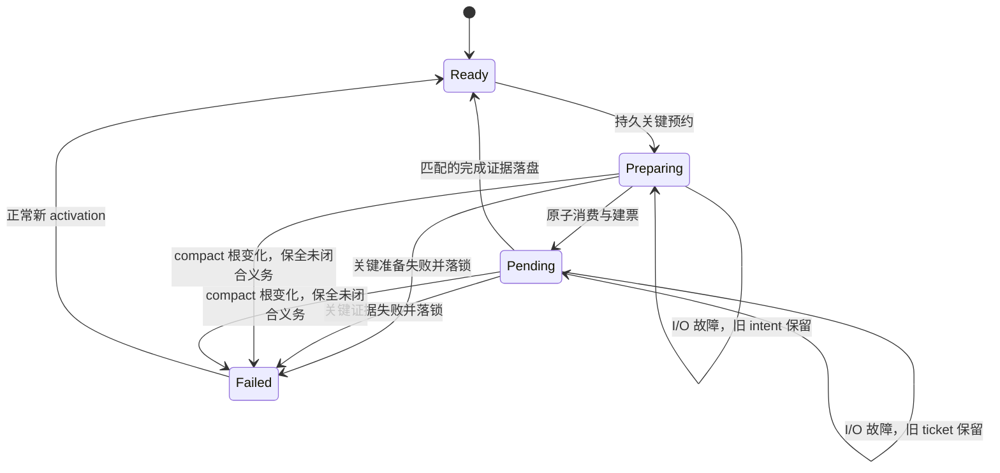

# 模型路由的最终逻辑

> 当前发布状态：DONE，提交 `0c56460` 已推送并同步本地 main，远端 CI 全绿。以下保留冻结阶段的分析与会审证据，最新状态见 [DEPLOYMENT.md](/Users/luca/Desktop/luca_gstack/framework-audit/2026-09-30-model-routing/DEPLOYMENT.md)。

推荐采用 **公共角色策略 + 私有模型关系 + 宿主证据 + 持久准入门**。这是在当前 Codex 能力与用户批准顺序下的选择；不按型号名猜能力，不引入尚无数据的动态成本优化。源补丁已获两份独立 PASS 7/7 及同 SHA 完整验证 107/0；等待最后启用确认，生产 Hook 源尚未更新。

## 模型怎么选

| 角色 | 用途 | 选择 |
|---|---|---|
| anchor | 普通执行、事实收集 | 继承原生根会话实际模型 |
| peak | 已登记关键判断、独立审查 | 比较用户批准顺序；低于 peak 则升级，已达到或更高则保留根模型；关系未知拒绝 |
| light | 已登记机械任务 | 只有获批且明确低于根模型才选；否则继承 anchor |

用户批准 `gpt-6-sol < gpt-6.1-sol < gpt-6-astra`，关键审查用 astra。当前根为 `gpt-6.1-sol` 时：worker/explorer 继承它，quality-gate 选 astra，preflight-agent 选获批的 `gpt-6-luna`。根已是 astra 时，审查仍必须冷启动。

路由保留 caller 的 effort 字段，effort 不参与模型档位推断；实际值还受宿主与 agent 配置优先级影响，须核验 metadata。

## 调用如何被接受

1. 从原生事件读取真实根模型与 activation；按精确 agent_type 或 workflow/phase 识别场景。prompt 的词语和 caller 的 model 参数不能冒充身份。
2. 新 native/runner 入口检查既有失败锁、未闭合 preparation 与 critical invocation；有任一项则拒绝继续。
3. 关键准备先持久记录 intent，再读私有 binding 与选模型。native 在 host 写锁内重查既有 critical ticket；仅仅读过空快照不算准入。预约不可写时不开始模型准备。
4. 独立审查强制 `fork_turns=none`，包括同模型和数字历史 fork。
5. 项目身份单独校验。完整验证的 NO_PIN 不需要项目选择事件，也不会因此获得项目授权；有 pin 或 nested child 保留原验证。
6. native 建票再次在 host 写锁内检查 critical ticket；校验 preparation 的 activation/generation/task/harness，原子消费 intent 并建立 invocation envelope。
7. 派发后核验实际采用模型、同次调用成功和 completion 证据；请求参数本身不足以证明成功。
8. 证据正常闭合才继续。关键准备、运行或 evidence 失败不能产生可信降级 JSON；无法写失败锁时，已有 intent/pending ticket 仍阻断后续入口。

这里描述关键义务。compact、换根模型和修复 binding 都不能偷偷解除同 activation 的失败锁。

## 明确的权衡与能力边界

原生关键会审按顺序闭合证据，再开始新派发。非关键原生任务仍可并行，一个已准入 runner 内的关键任务也仍可并行；已准入的在途任务不承诺撤销。

当前 native 身份：default/worker=MR-001，explorer=MR-006，preflight-agent=MR-008，quality-gate/muse-proto-judge=MR-004。MR-002/003/005/007 没有独立原生入口；目前关键规划或红队裁决通过真实 MR-004 专家评估，不能假称 prompt 已接通其他场景。

Codex common v2 与 Claude legacy 兼容规则分开；不声称两者运行时强制能力相同。原生日志能证明实际模型与同轮完成，不能证明穷尽观察了所有内部 reroute。

完整问题、备选方案、真实失败原判、测试、冻结补丁及启用范围见 [验收报告](/Users/luca/Desktop/luca_gstack/framework-audit/2026-09-30-model-routing/REPORT.md)。

<!-- FILE_END: ROUTING-LOGIC.md -->
